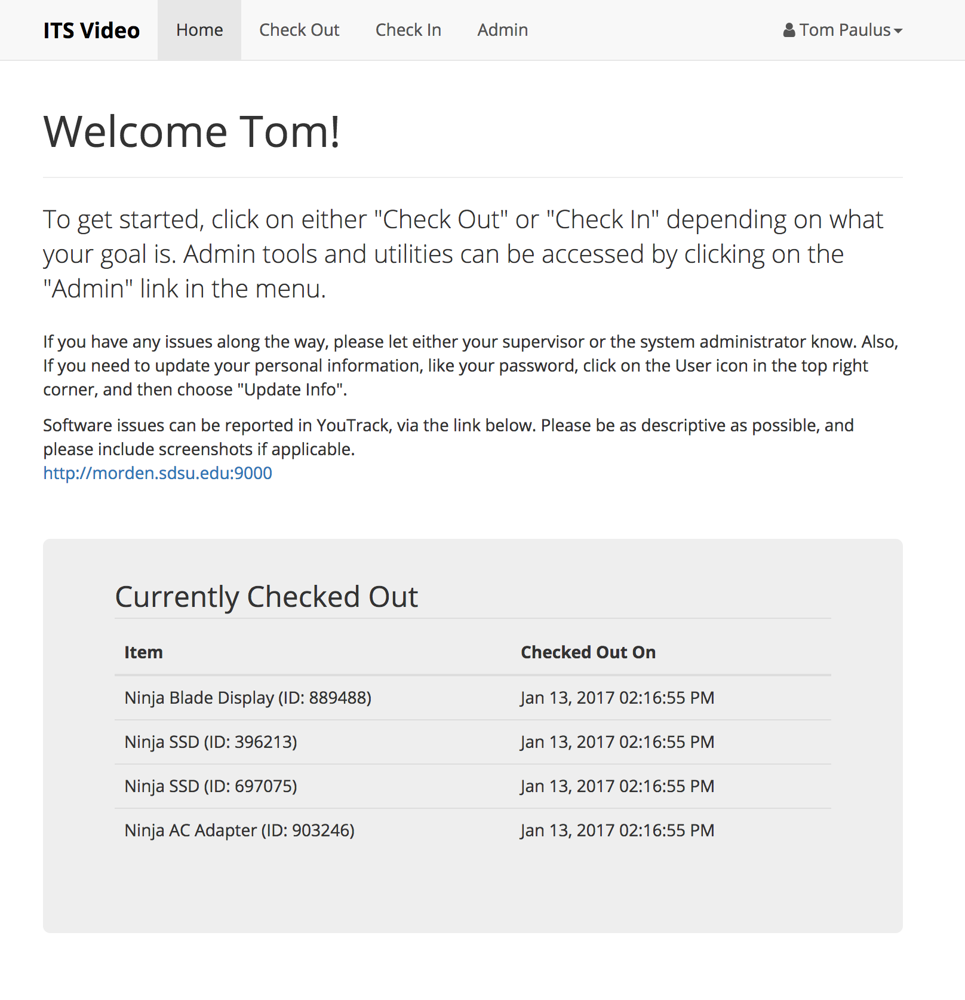

# Inventory Management

The Inventory Management (IMs) is a system that allows the history and condition of a variety of inventory items to be tracked as they are used by various individuals.

The system is designed to be implementation agnostic, allowing you to customize what types of items are checked out, and how they are dealt with internally. Instructions on how to setup a new deployment of VIMs can be found in the [System Configuration](./config/README.md) section.

To access the system, you will need a valid set of credentials, these can either be obtained from a supervisor/admin user, or when the system is first deployed. The login modal can be opened by clicking on the login button in the top right corner of the nav bar.

Once logged in, the items that you currently have checked out will be listed, as well as some help text to help you get started. This text can be customized by editing the `welcome.view` view. Similarly, the public index page, which is shown to users who are not logged in, can be edited in the `index.view`.

From this point, you can check out or check in items. If your use account has supervisor/administrator rights, the admin button will also be available in the nav bar.

---

## License

 This work is licensed under a <a rel="license" href="http://creativecommons.org/licenses/by-sa/4.0/">Creative Commons Attribution-ShareAlike 4.0 International License</a>.
