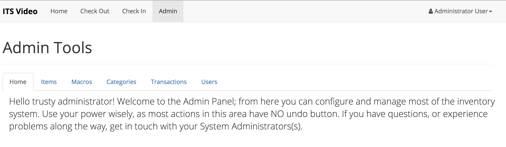

# Admin Overview

VIMS provides a vast array of tools for administrator/supervisor users to make managing their inventory system quick and easy. Each of the tools is broken down into their own pages to provide you quick and easy access to the information that you need.

The content that is displayed on the index page of the Admin Tools page can be modified in the `admin/index.view`.

# Definitions

**Item –** An item is something that can be checked out/in by a user. Items are the backbone of your inventory, and represent the smallest unit.

**Macro –** A macro represents a group of items. This can be a microphone kit, light kit. If you frequently call it a kit, and its contents rarely changes, it can probably be made into a macro. When a macro is scanned, all of the constituent items are added to the transaction list, allowing comments to be made on the individual items, which also can be independently removed in the event of a missing item.

**Category –** A category is just that, a category of items. These are used to identify similar items for the check-out kit list, which uses the item category to identify which parts of the checklist have been completed. Categories also include icons, which are displayed throughout the UI and on the [Transaction Report](./transactions.md#transaction-receipt-report).

**User –** Somebody who can login to VIMS and can interact with the inventory \(check out/in equipment\). Additional privileges can be given, by promoting the user to a "supervisor" which allows them to authorize transactions and access the admin interface.
