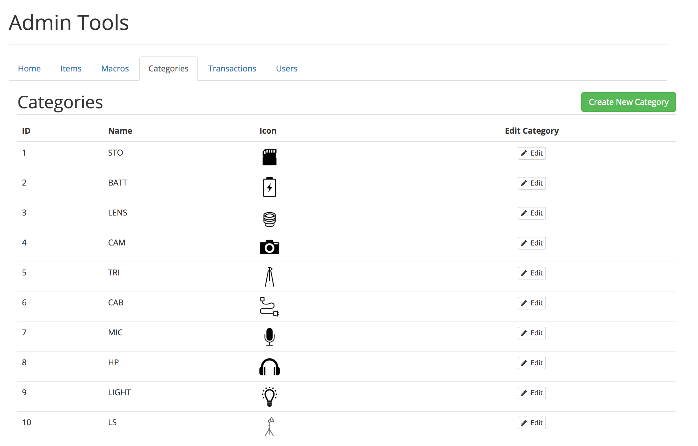
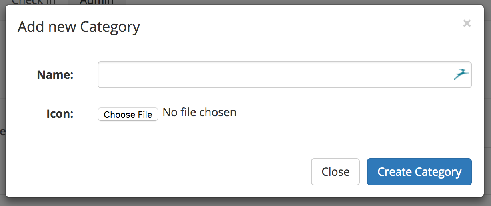
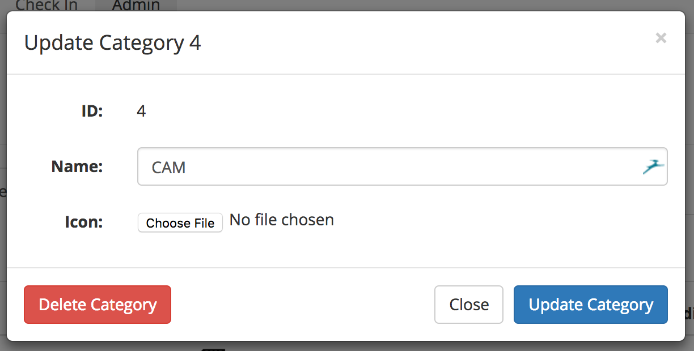

# Categories
Categories allows for items to be generalized by the system. This is especially useful in regard to completing the Checkout [Kit List](../config/kit.md), as well as for assigning icons throughout the UI. Specifically, the icons are shown in the checkin/checkout lists, as well as the Transaction Report.

When you click on the Categories submenu in the Admin view, all of the categories, and their corresponding icons are loaded in a list view.

## Create a Category
To create a new category, click on the green "Create New Category" button in the top-right corner of the view.

Here you can enter the desired name for your category, it is recommended, although not required, that you use a short abbreviation. For examples, for our Storage Media category, we use the abbreviation STO. You can upload an image, although please keep in mind that images will be resized proportionally to a maximum height of 100px. If the icon has transparency, it will be removed, and replaced with a white background.

## Edit a Category
Categories can be quickly edited via the "Edit" button found on the right side of every row. Clicking that button will bring up the Edit modal for that category.

Similar to creating a new category, you can change the name of the category, and the associated icon. When you are done, click on "Update Category" and your changes will be saved, and the icon updated.

## Compatibility with Kit List
The Kit List uses the item's category to determine whether or not that requirement has been fulfilled. This is achieved by exactly matching the item's category name to the category name defined on the kit list. They must match exactly!
