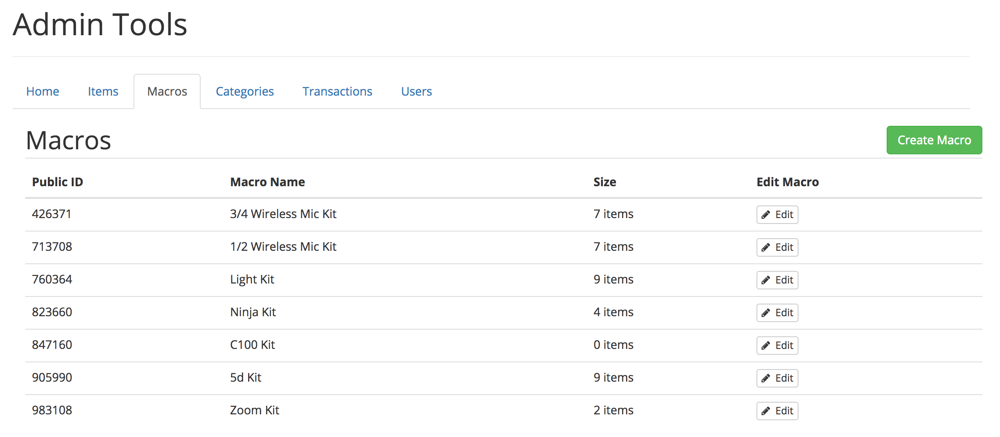
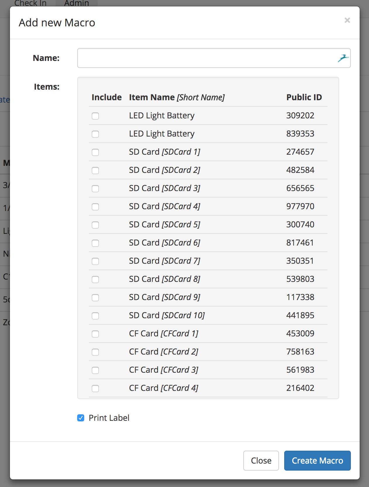
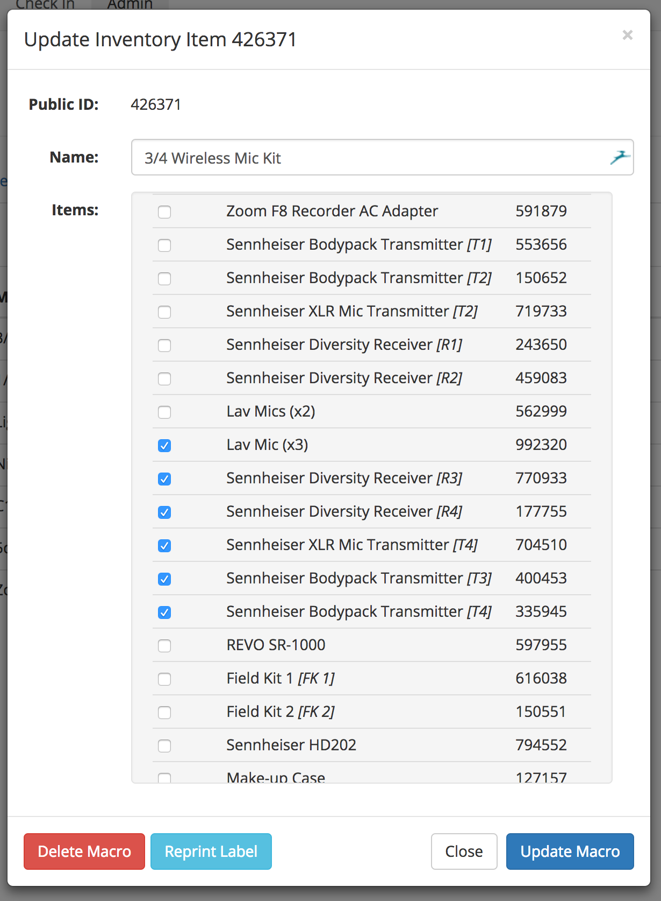

# Macros

Macros allow multiple items, often in a pre-packaged kit, to be identified by a single code. This barcode would be on the outside of the kit, and scanning it would load all of its constituent items to the current transaction.

When you first click on the Macros submenu, a list of all the macros is loaded. Similar to the Items view, you can click on any of the column headers, with the exception of the "Edit Macro" column to have the column sorted ascending/descending based on that column. If you are looking for a specific macro, use your browser's find tool.

## Create a new Macro
To create a new Macro, click on the green "Create Macro" button in the top right corner of the view.

Once the modal loads, you can give the item a name, and select the constituent items. The name is only displayed in the Admin Tools view, and can be as long as you like. For each item that you would like to include in the macro, click the corresponding include checkbox next to the item. The short name of every item, if applicable, is displayed next to the item's name in square brackets.

## Edit a Macro
To edit a Macro, click on the "Edit" button in the row corresponding to the item you would like to edit. A modal should appear shortly after, although this may take a moment, depending on how many items are in your inventory, and the number of items included in the specified macro.

From this point, you can delete the macro, reprint its label, or modify its constituent items. When you are done, click on the "Update Macro" button to save your changes.

Additionally, Macros can be deleted at any time, which is a permanent, non-reversible action.