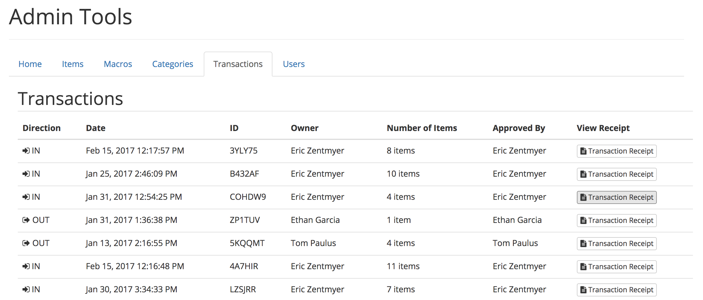
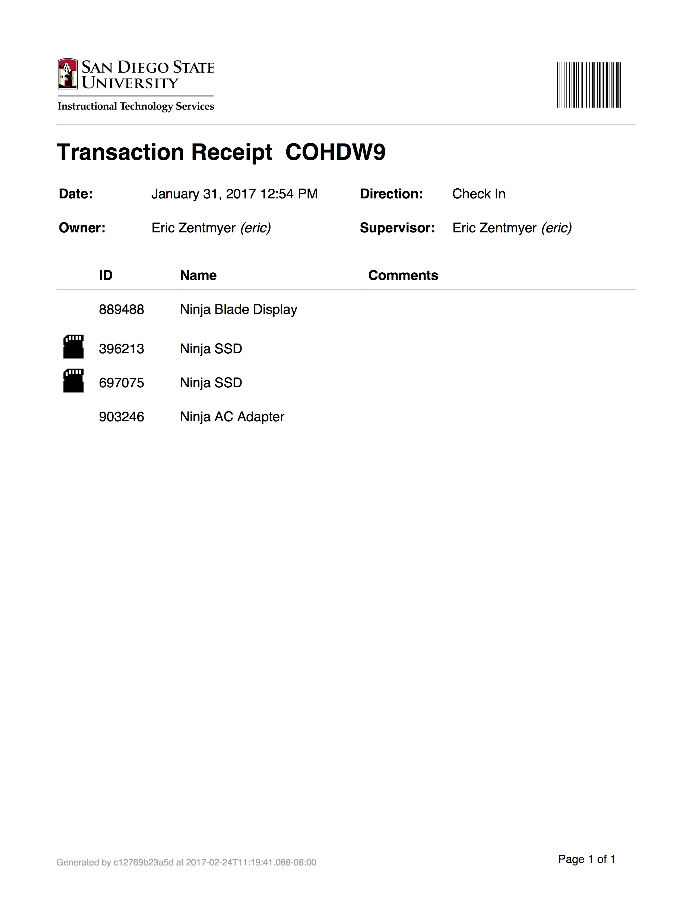

# Transactions

A transaction is created for each time an item is checked in or out. Once a transaction has been created, it cannot be changed or deleted. Each transaction saves the owner, the authorizer, the item, as well as each item's respective condition.

Clicking on the Transaction sub-menu shows a list of all of the Transactions in the system.

The list shows the direction of the Transaction, when the Transaction took place, the 6-character ID, and the personnel associated with the transaction and the size of the transaction.

## Transaction Receipt

For each transaction, a Receipt is generated on-the-fly which can be printed and/or saved off-line. This receipt contains all of the pertinent information for transaction. The URL used to generate the transaction can be shared, as authentication is not required to access the content, as no changes can be made. An example of a Transaction Receipt is below.

