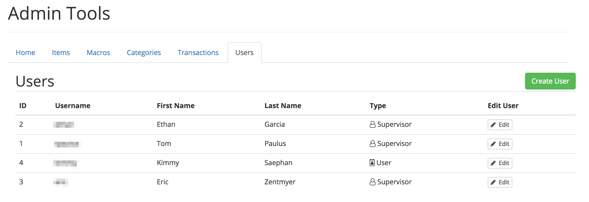
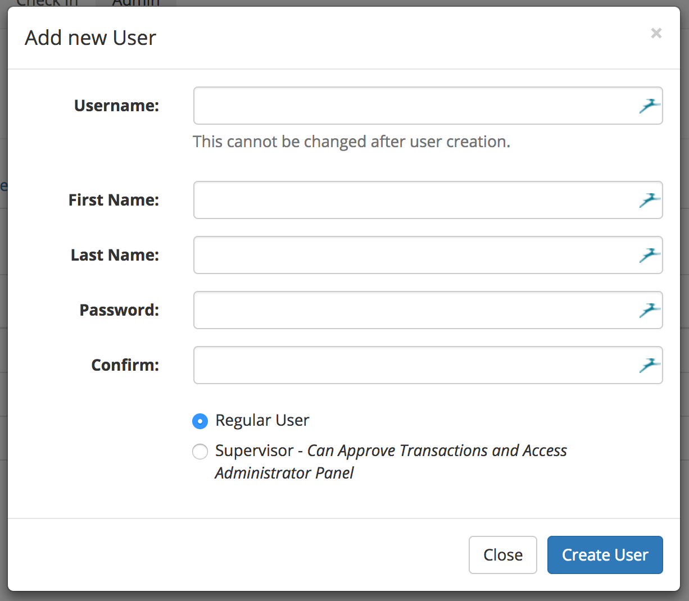
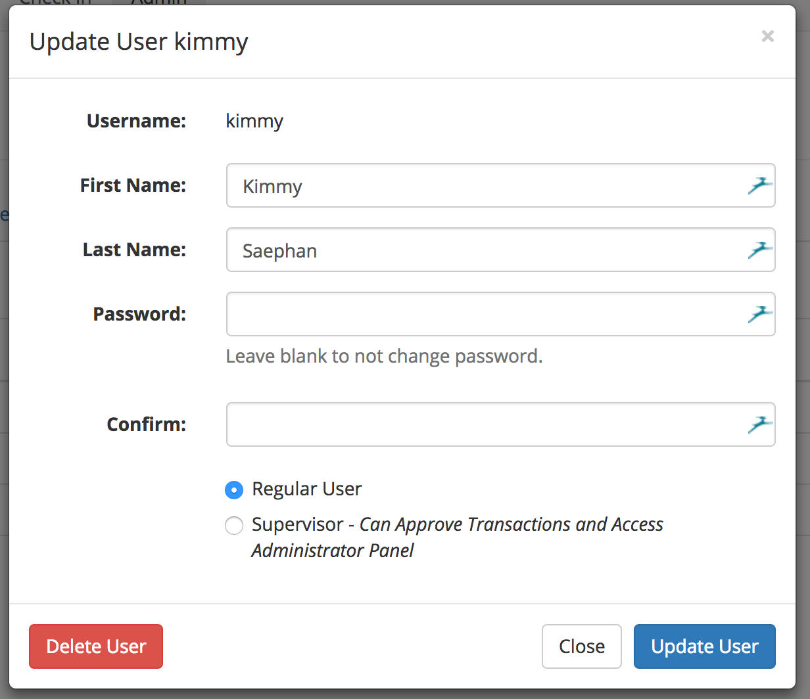

# Users

A user is somebody that can login with a username and password. Each individual using the system should have their own login, to ensure that accountability is maintained. User accounts can be created by any administrator/supervisor user.

To view a list of all users, click on the "Users" submenu in the Admin view.

## Passwords
While users can change their own password, and administrator can change any user's passwords. This was done to allow passwords to be reset, without complicated reset procedures.

## Create a New User
To create a new user, click on the green "Create User" button in the top-right corner. A modal prompting you for the user's information will appear.

The username will be lowercased automatically, and all fields on the form are required. Supervisors have access to the administrator panel and are allowed to authorize transactions. Once created, the username cannot be changed.

## Edit a User
To edit a user, click on the edit button in the row that corresponds to the user you would to edit.

Once the user has completed a transaction, either creating or authorizing, they cannot be deleted. This is done to preserve the integrity of the database. If you are not changing the user's password, leave both the "Password" and the "Confirm" boxes blank.
