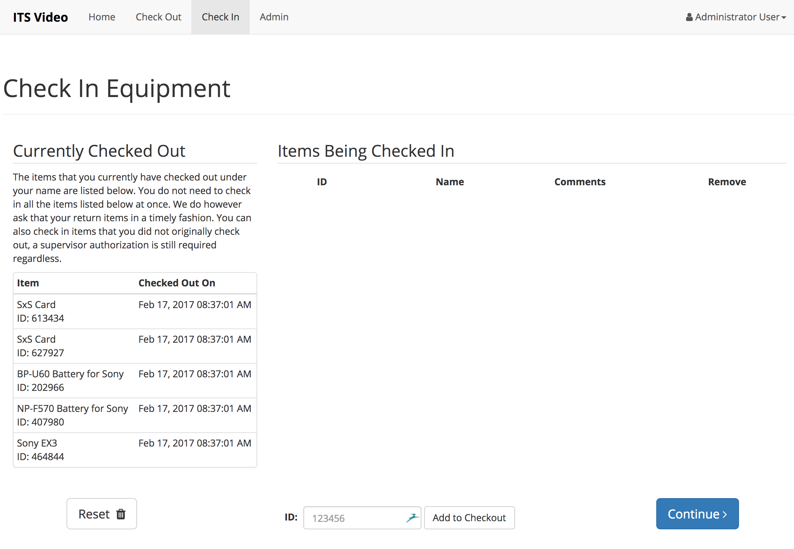
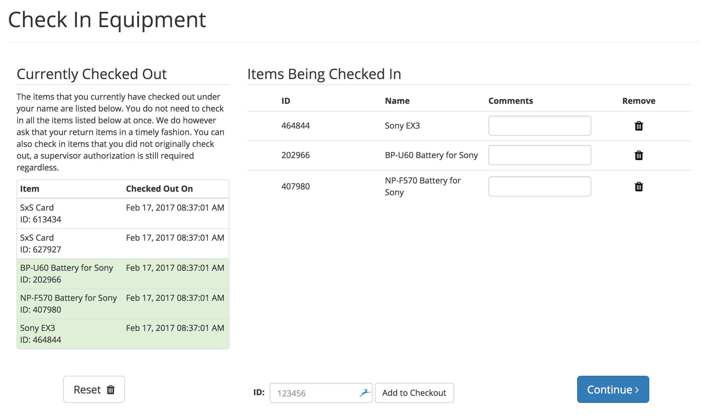
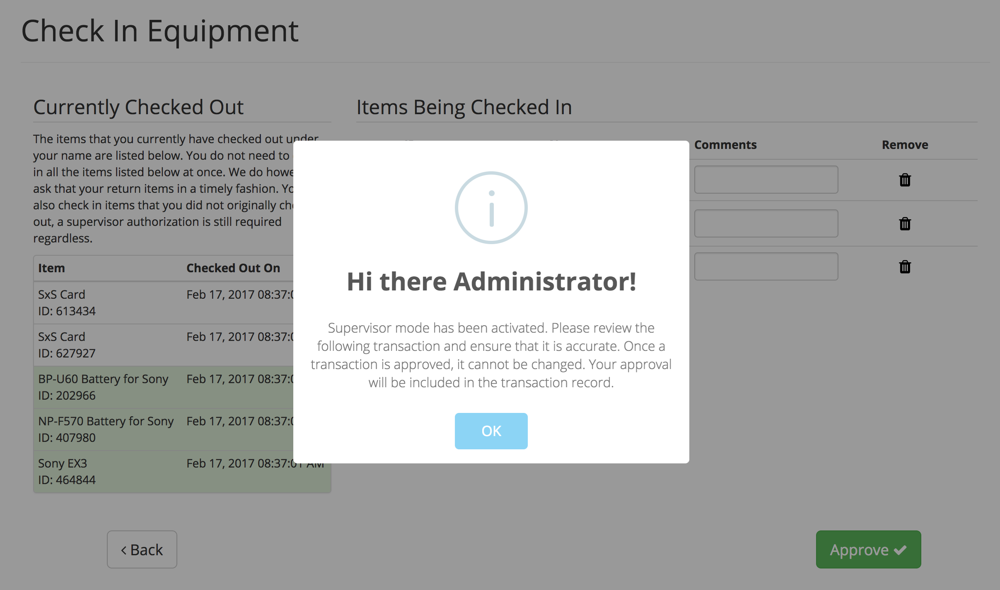

# Item Check-in

After your event, you can check-in your equipment. Ideally, all items in your inventory are always ready for checkout. In our application, users should wait with checking in storage media, as it should be formatted and ready to use when it is being checked-in. You can check-in only some of your items, and complete another check-in at a later time.

## Checking In Items

On the left side of the check-in view, there is a list of all the items you currently have checked out. As you check-in items from this list, they will go green. The items in the main table are the items that will be checked-in in this transaction. Please use this opportunity to make any notes on the item's condition in the comments field. If there were any comments previously included for the item you are checking in \(for example if you included some during checkout\), they will be prefilled for your convenience.

Once you have completed adding all of your items that you are ready to return to the list, click on the continue button in the bottom right corner to continue to the supervisor approval step.

## Supervisor Approval

Similar to the checkout procedure, unless the current user is an supervisor, a supervisor will need to authorize the transaction. This is to ensure that all transaction are accurate. Once the supervisor logs in, they will be able to make changes to the comments, and remove items from the transaction as necessary. Once they have ensured that the transaction is accurate, clicking approve will submit the transaction to the server and complete the checkout process.

Once a transaction is approved and submitted, it cannot be changed or updated to ensure that the information contained within is not mutated and therefore invalidated. If you are done using the Inventory Manager for the time being, be sure to **log out**!

