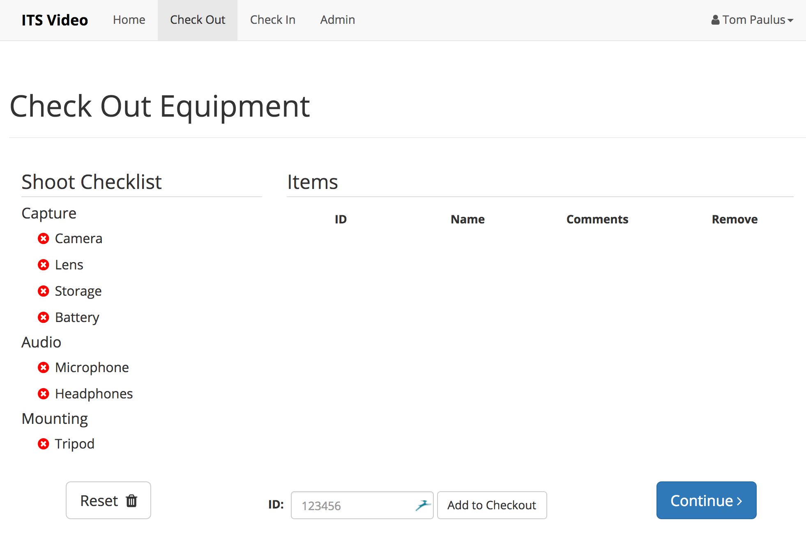
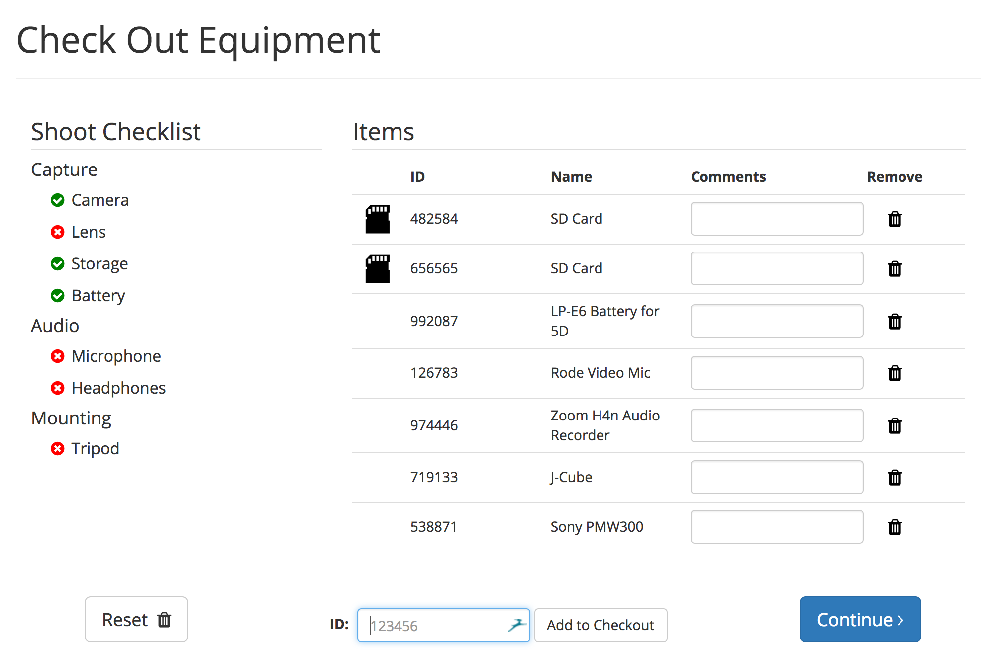
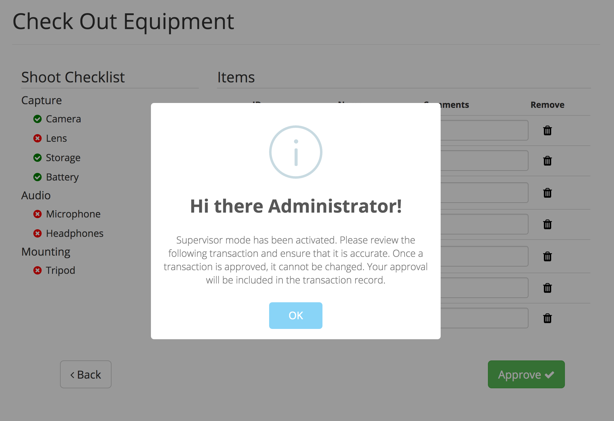

# Item Checkout

When you go out for a shoot, you will want to check out the items that you are taking with you, as well as note their condition. To start a check out, login and click on the Checkout Tab in the Menu Bar at the top of the page.

## Checking Out Items

Now, either scan the inventory tags on all of the items you would like to take with you, or type in their IDs into the ID field at the bottom of the page. As you add items, the shoot checklist on the left side will begin to be completed. If you need to remove an item from the checkout you can click the trash can icon to the right of the item you would like to remove, and both the item list, as well as the checklist will be updated to reflect the changes. You can enter comments for each item, which will be saved with the transaction. Comments are useful to note the condition of an item.

Once you have completed adding all of your items that you are taking out to the list, click on the continue button in the bottom right corner to continue to the supervisor approval step.

## Supervisor Approval

Unless the current user is an supervisor, a supervisor will need to authorize the transaction. This is to ensure that all transaction are accurate. Once the supervisor logs in, they will be able to make changes to the comments, and remove items from the transaction as necessary. Once they have ensured that the transaction is accurate, clicking approve will submit the transaction to the server and complete the checkout process.

Once a transaction is approved and submitted, it cannot be changed or updated to ensure that the information contained within is not mutated and therefore invalidated. If you are done using the Inventory Manager for the time being, be sure to **logout**!
