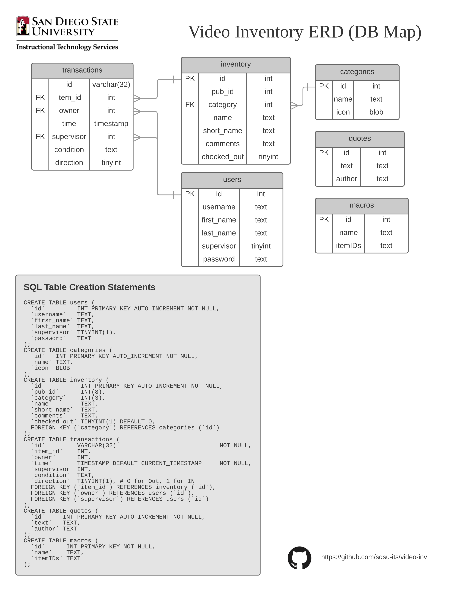

# ERD


## DDL
```sql
CREATE TABLE users (
  `id`         INT PRIMARY KEY AUTO_INCREMENT NOT NULL,
  `username`   TEXT,
  `first_name` TEXT,
  `last_name`  TEXT,
  `supervisor` TINYINT(1),
  `password`   TEXT
);
CREATE TABLE categories (
  `id`   INT PRIMARY KEY AUTO_INCREMENT NOT NULL,
  `name` TEXT,
  `icon` BLOB
);
CREATE TABLE inventory (
  `id`          INT PRIMARY KEY AUTO_INCREMENT NOT NULL,
  `pub_id`      INT(8),
  `category`    INT(3),
  `name`        TEXT,
  `short_name`  TEXT,
  `comments`    TEXT,
  `checked_out` TINYINT(1) DEFAULT 0,
  FOREIGN KEY (`category`) REFERENCES categories (`id`)
);
CREATE TABLE transactions (
  `id`         VARCHAR(32)                             NOT NULL,
  `item_id`    INT,
  `owner`      INT,
  `time`       TIMESTAMP DEFAULT CURRENT_TIMESTAMP     NOT NULL,
  `supervisor` INT,
  `condition`  TEXT,
  `direction`  TINYINT(1), # 0 for Out, 1 for IN
  FOREIGN KEY (`item_id`) REFERENCES inventory (`id`),
  FOREIGN KEY (`owner`) REFERENCES users (`id`),
  FOREIGN KEY (`supervisor`) REFERENCES users (`id`)
);
CREATE TABLE quotes (
  `id`     INT PRIMARY KEY AUTO_INCREMENT NOT NULL,
  `text`   TEXT,
  `author` TEXT
);
CREATE TABLE macros (
  `id`      INT PRIMARY KEY NOT NULL,
  `name`    TEXT,
  `itemIDs` TEXT
);
```
