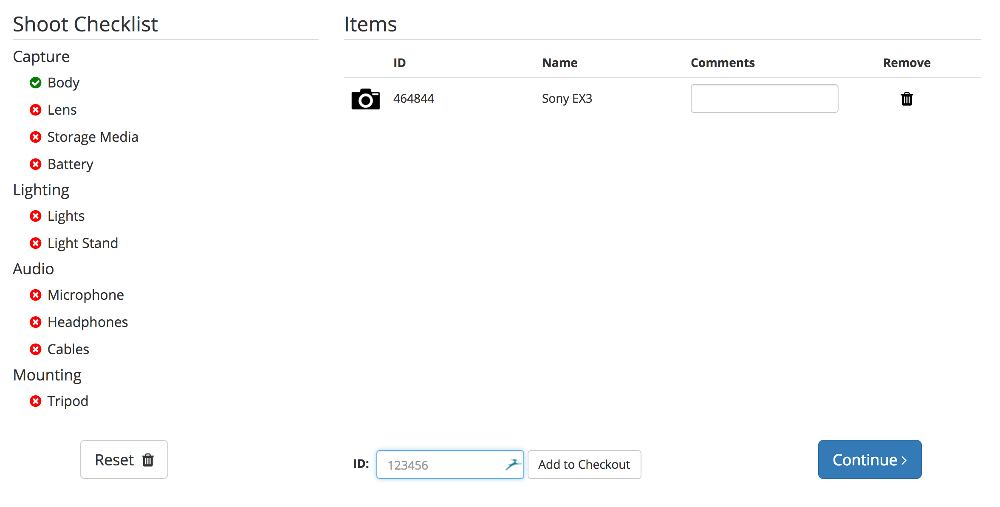

# Kit List

The kit list is the checklist that is displayed on the left-side of the checkout view, that reminds users who are checking out equipment to include all of the key components. This list is controlled by the `kit.json` file. This is a simple JSON file that is loaded on page load by the front end.

As items are added to the transaction, they will be checked off on the list, based on the category that the items that have been added to the transaction.



## Format

```json
{
  "Section Title": [
    {
      "Name": "List Item Name",
      "Category": "Category ID"
    }
  ]
}
```

The kit file can be found in `src/main/webapp/kit.json`, and an example of our production kit file can be found on [GitHub](https://github.com/sdsu-its/video-inv/blob/master/src/main/webapp/kit.json).

By modifying the `kit.json` file, you can change the section title, List Item names, and their corresponding categories. In regard to the Category, the name entered in the kit file, must match the category ID for the [category](../admin/categories.md). Other than that, the file follows standard JSON formatting.

A copy of the JSON Schema can be found at [http://json-schema.org/](http://json-schema.org/).
