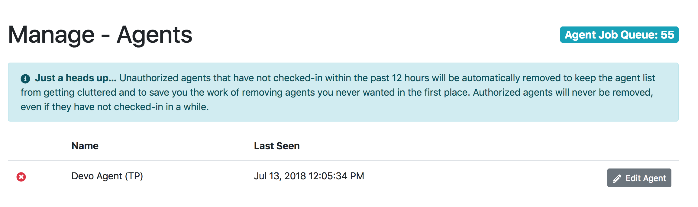
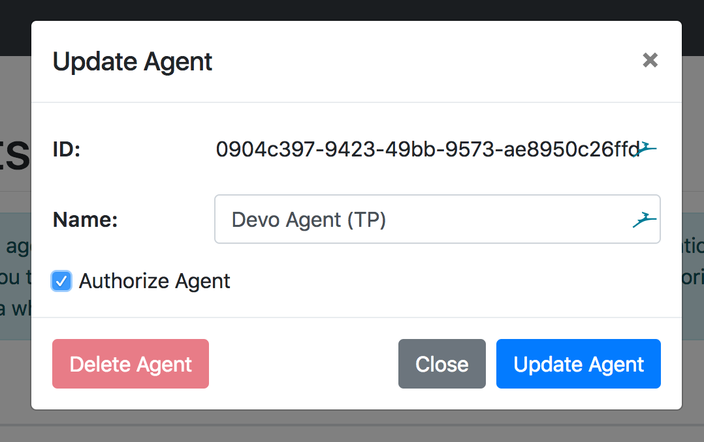

# Deploying an Agent

Agents are the workers for the Recorder Monitor. Agents allow the server component to be deployed outside of the network to which the recorders are connected to. This is especially useful in corporate or educational networks were security is key. If your web server will be running on the same network as the recorders, the directions below still apply, but you can deploy both the server image and the agent image to the same Docker host.

The latest version of the Agent image is available in the [Docker Hub](https://hub.docker.com/r/wssystems/mms-agent/), and is updated whenever a new version of Mediasite Recorder Monitor is released. It is important that the versions of the Agent and the Server match up to avoid incompatibilities and strange behaviors.

## Create the Container
You will first need to make sure that Docker (Community Edition is more than sufficient) is running on the host you want to deploy the agent to. Instructions on how to do this can be found on [Docker's Website](https://docs.docker.com/install/).

The agent authenticates with the server using a unique ID that is generated on first run, this is then saved to allow the agent to be authenticated, even after container restarts. While it is not required to setup the volume mapping for the container, it is recommended to reduce downtime.

You will need to set the `MS_MON_SERVER_URL` to the URL of the Mediasite Recorder Monitor Server this agent will report to. The `MS_MON_AGENT_NAME` does not need to be unique and is used to identify the agent to users in the Web Admin Panel from within the Monitor.

```sh
docker create --name mms-agent \
  -e MS_MON_SERVER_URL="<MMS Server URL>" \
  -e MS_MON_AGENT_NAME="<Display Name Agent>"
  -v <local config path>:/var/lib/ms-mon-agent/config.properties \
  --restart=always \
  wssystems/mms-agent

docker start mms-agent  
```

## Authorizing the Agent
Once the agent has started up and gone through its initialization, it will register with the Server. You will need to authorize the agent before it can access your credentials and start working on queued jobs. This is to prevent unauthorized agents from gaining access to your configuration and causing issues in the Job Queue.

From the Monitor Web interface, access the Agents panel from **Manage > Agents**. There you will see a listing of all the agents.


To authorize the agent, click on the "Edit" button, then check the "Authorize Agent" checkbox, and then "Update Agent." Within 30 seconds, the agent will pull the configuration from the server and start working jobs that are in the queue (if there are any).



## Updating the Agent
When you update the Recorder Monitor Server, you may need to update the agent as well (this will typically be specified in the release/commit notes). To do so, you will need to stop and delete the existing agent container, then pull and start the new version.

::: warning
You will want to make sure the job queue is empty when you stop the agent, else the job in progress might be delayed. If you need to update the agent while there are jobs queued, you can reauthorize the agent, wait about 5 minutes for the currently executing job to finish, then stop the agent.
:::

```sh
docker stop mms-agent
docker rm -v mms-agent

docker pull mms-agent

docker create --name mms-agent \
  -e MS_MON_SERVER_URL="<MMS Server URL>" \
  -e MS_MON_AGENT_NAME="<Display Name Agent>"
  -v <local config path>:/var/lib/ms-mon-agent/config.properties \
  --restart=always \
  wssystems/mms-agent

docker start mms-agent  
```

Because of the volume mapping, you will not need to reauthorize the agent.
