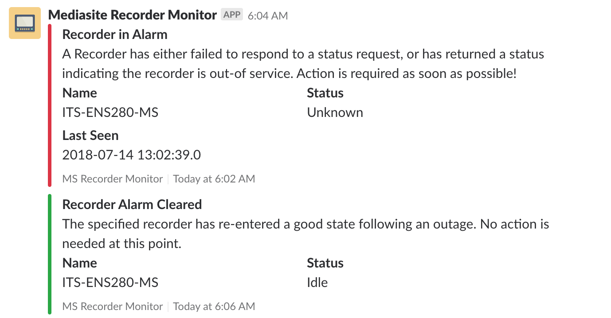

# Configuration
Now that you have gone about installing the Web Server, we can start with configuring the Monitor to work the way you want it to. However, first you will need to login.

## Creating Your First User
By default, any user who logs in using the configured OpenID Connect Client is given the "User" role, which allows them to view the recorder list, and the details about a given recorder, but does not allow them to view or use any of the Management functions. To promote a user to the "Admin" role, you need to be an Admin yourself. Which poses the interesting issue of the first admin. This is accomplished using the Super User login option, which is described below.

1. Login using your OpenID Connect Credentials. This creates your user account, which we will promote in the next steps.
2. Login to the Super User console, which is located at `http://<Your URL>/superuser`. You will be prompted for a password, which can be found in the Server log files. If you are running in a Docker Container, you can quickly retrieve this password via the following command:
```bash
docker exec mms-server cat /usr/local/tomcat/logs/MS-recorder-monitor.log | grep "Super User Password" | tail -1
```
3. Once you have signed in, you will see your name as "Super User" in the top right corner. You can now access the **Manage** Menu and change your user's role.
4. From **Manage > Users**, click on the Edit User button next to the desired user and update the role to the desired setting. Be sure to hit Update when you are done.
5. Logout of the Super User and login as you (like in step 1). You should now find yourself having the **Manage** dropdown in the Nav Bar.

## External Integrations
External Integrations enable Mediasite Recorder Monitor to leverage outside services to extend the capabilities of the Web Core. Each of the available integrations are listed below, in addition to a short description of the respective service, and its available configuration. The list of available integrations, as well as their configuration options can be found in the **Manage > External Integrations** menu in the nav bar.

### Mediasite
The Mediasite integration is arguably the most important one, since without it, we have no recorders to monitor. To setup the Mediasite integration, you will need to create a user with the necessary permissions (this depends on what jobs you will be running), as well as an API Key, which can be accomplished via the following link (replacing the placeholder with your installation URL): `http://<Your URL>/mediasite/api/Docs/ApiKeyRegistration.aspx`. Enter all of the credentials you have generated into the corresponding fields in the Mediasite integration settings, and once you configure the [Sync Rates](#sync-rates), you will see your recorder list populating with your recorders from your fleet.

### Email
Notification emails are sent via SMTP. It is critical that you define your SMTP server details here to make sure Mediasite Monitor is able to send notification emails to you and your users. Any SMTP server can be used, although using one that supports SSL is recommended for security. If you don't have access to an SMTP server, transactional email services like [SendGrid](https://sendgrid.com/) or [Mailgun](https://www.mailgun.com/) have a rather generous free plan that should suffice for most installations.

The From Name and Email are used in the creation of the Email Message and are shown to the user in their mail client. If you want users to be able to reply to the messages, setting a Monitored Inbox as the "From Email" would allow this to be done. You will want to use something recognizable for the From Name to help your users in identifying the messages.

### Slack
Slack is tiring to reduce the number of emails employees have to deal with in a given day, and Mediasite Recorder Monitor tries to help you with this goal, by allowing notifications to be sent to either a user directly or a group via Slack's Webhook Integration. To get started, you will need to an "Incoming WebHooks" App to your Slack Organization. Once you chose the destination user of channel, you will be shown a Webhook URL, copy & paste this into the "Webhook URL" field in the Mediasite Recorder Monitor configuration page. Enable the integration, then hit save. Notifications like the ones shown below will now be sent to the desired channel/user.



## Sync Rates
The Sync Rates menu, found user **Manage > Rates** determines the frequencies of the various checks that Monitor Runs. Each of the setting groups are listed below and offer a detailed description of each of their respective settings. Updates to the rate settings can require changes to all jobs in a given group, potentially causing a short disruption in job processing. While this should not discourage you form changing the settings, avoid doing so in very quick succession, especially changing the same setting multiple times in quick succession.

### Recorder List
The central Mediasite server, which you set in the [section above](#external-integrations), keeps a list of all of the recorders that are registered with that instance of Mediasite. This is the list Mediasite Recorder Monitor basses its list of recorders off of, and is synced periodically by this job. It is seen as a relatively low priority job, so other jobs (like the Status or Expectation check) will take priority over it.

It can either be enabled or disabled (although it is not recommended to disable it, since if the recorder IP changes, that change is picked up by the List Sync), and you can set the frequency of the job. The default frequency is every 15 minutes.

### Recorder Status
The status of each recorder is queried directly from the respective recorder's onboard API. Using the information obtained from the List Sync, an agent checks-in with each recorder and reports the status back to the central monitor server.

This job can be enabled or disabled. Additionally the frequency of the job can be set, with the default being every 3 minutes. Occasionally, a network issue may cause a false alarm, indicating that a recorder is offline when it is in-fact online. To prevent this, a status check can be retried a number of times, which is defined by the "Retry" setting. After the defined number of checks have failed, the status is marked as "Offline" and a notification is issued.

### Recorder Expectation Checks
Recorder Expectations make use of the Schedule feature inside of Mediasite. Expectation Checks ensure that our expectations of recorders are met in a timely fashion. These are used to check if a recorder is recording when a recording has been scheduled, but may be expanded at a future date to encompass other expectations.

The schedule is pulled from the central Mediasite server once daily, at the specified "Pull at" time, provided the checks are enabled. At the pull time, a job will be scheduled for 5 minutes after a recording is supposed to start, at which time the status is pulled and an notification issued if the reported status does not match the expected status.
