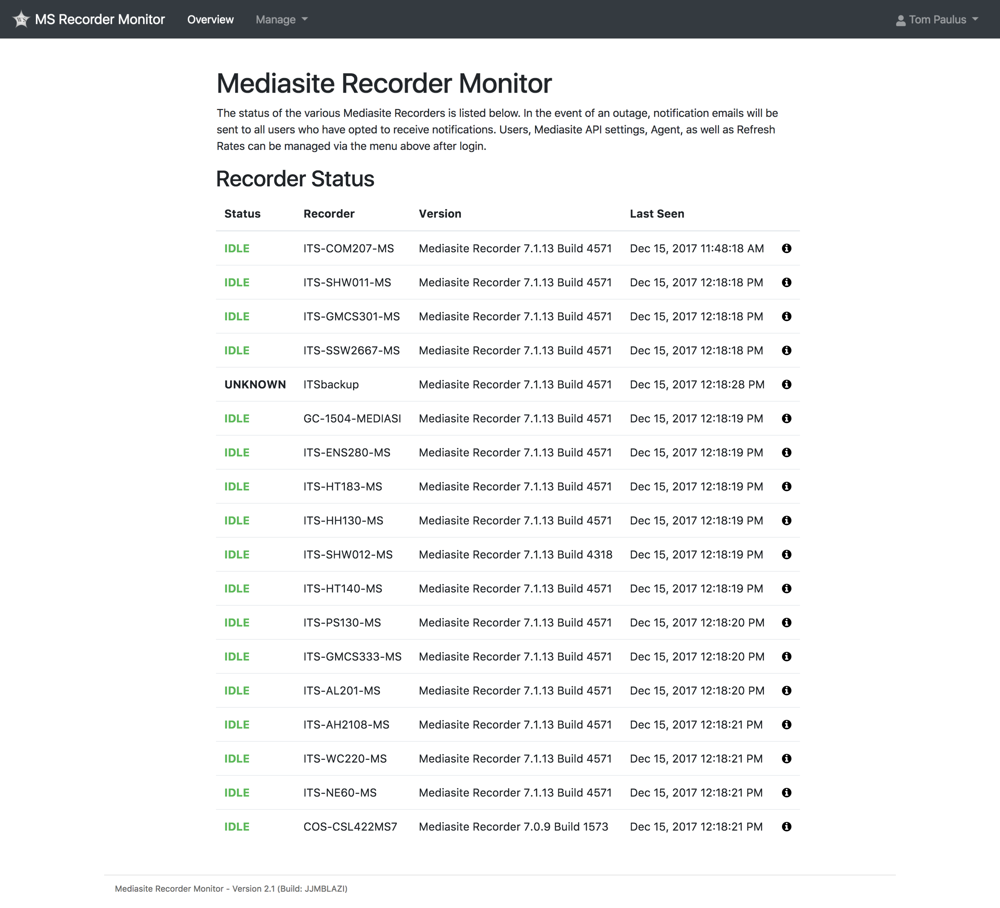
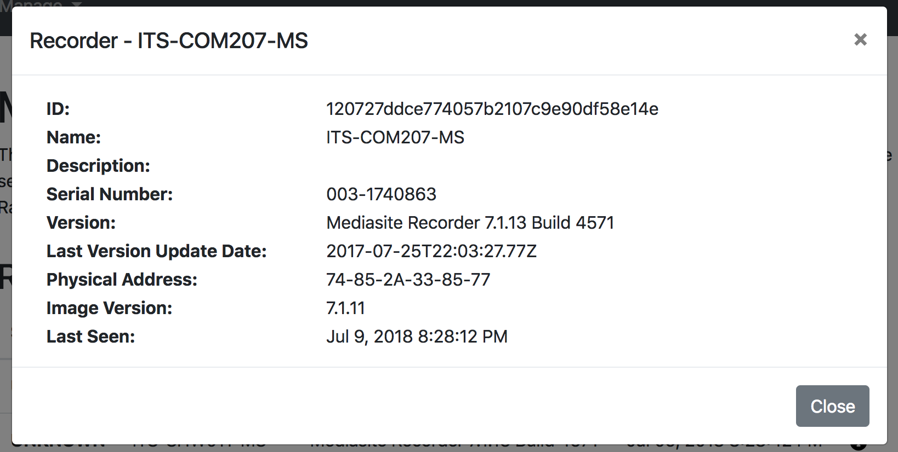

# Day-to-day Usage

Mediasite Recorder Monitor tries to make your life as easy as possible by automating most of the daily processes, so you can do the more fun and exciting things on your plate.

## The Overview Page
The overview page is accessible to any logged-in user and shows a list of all of the recorders and their respective statuses. The page is updated live as long as the user is logged in via Server Side Events.

Additional information about a recorder can be viewed by clicking on the info icon next to a recorder. This information is queried from the server at request time, so it is up-to-date, but not updated live.

## Adding/Removing Recorders
Adding new recorders in Mediasite Recorder Monitor is easy. You don't have to do a thing. Simply add the recorder to your Central Mediasite Instance, and the next time the Sync Recorder List job is run, you new recorder will be added to the list. The same goes for removing recorders. Once a recorder is removed from the Mediasite Server, the list is updated the next time the Sync Recorder List job is run ([typically ever 15 minutes](./configuration.html#recorder-list)).

## Notifications
### Via Email
Email is the default way that notifications are sent out. Email notifications are sent to all subscribed users for the following situations:
- On Recorder Alarm Activate
- On Expectation Fail

Email alert subscriptions are an all or nothing deal, you either get them or you don't. If you find yourself getting to many notifications, you may need to adjust the [rate settings](./configuration.html#sync-rates), or consider using a different notification method, like [Slack](#via-slack).

### Via Slack
Slack notifications can be enabled by setting up the External Integration as described [here](http://localhost:5000/ms-mon/configuration.html#slack). Slack notifications are sent either to a user or an channel, depending on how the integration is setup within Slack, so users do not need to individually subscribe; they don't even need an account to receive the notifications. Slack notifications are sent for the following situations:
- On Recorder Alarm Activate
- On Recorder Alarm Clear
- On Expectation Fail
