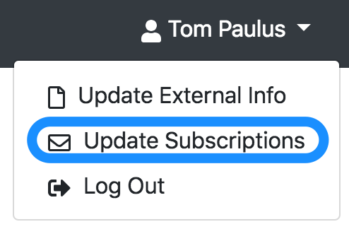
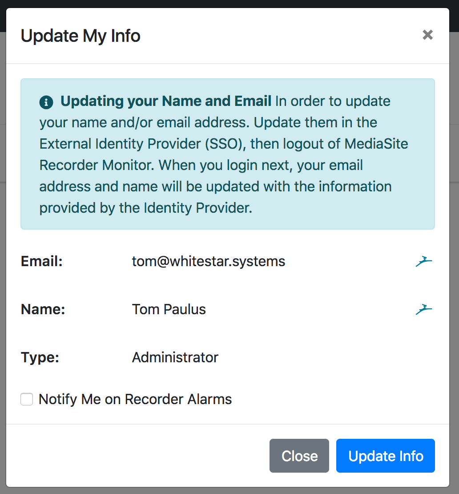
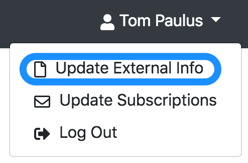
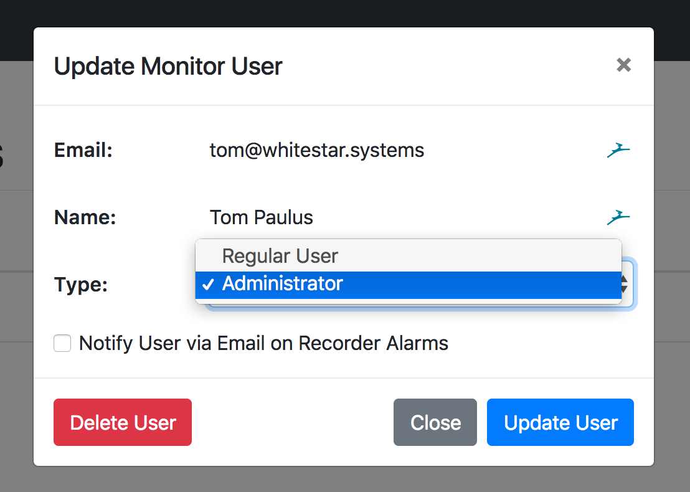

# Managing Users
User management is made easy since OpenID Connect is used to manage user data and login. Much of the hard work is done for you, but this page offers some insight into how the OpenID Connect agent creates users / updates their data.
All of the options/tools described below can be found in the **Manage > Users** menu in the Nav Bar.

## User Creation
Users are created automagically as necessary by the OpenID Connect agent when a user logs in for the first time. The user's name and email address are included in the login information, and those are used to set the necessary fields inside the app. When the user first logs in, they are prompted whether or not they would like to subscribe to email notifications. This setting can always be changed by the user under the **Update Subscriptions** modal, which can be opened by clicking on the user's name in the top-right corner of the Nav Bar and choosing **Update Subscriptions** from the drop down.

## Updating Users
Should a user need to update their name or email, they will first need to make the necessary changes in the OpenID Connect provider (like Hub), then login to Mediasite Recorder Monitor. If they are already logged in, they will need to logout and then log back in for the changes to be made. This is because the OpenID Connect agent only includes the updated information when the login request is handled by the provider, not if the session is already active.

A quick link is provided for users to update their information in the External Identity provider via the **Update External Info** link which can be accessed by clicking on the user's name in the top-right corner of the nav bar, then choosing the **Update External Info** option from the dropdown that appears.

## Changing User Roles
This is one of the few things you (the admin) will have to do by hand. By default, all new users get the role of "User" which grants them only the ability to see the overview and the specific details of each recorder, but not any of the configuration settings. The first user is promoted using the Super User method, which is described [here](./configuration.html#creating-your-first-user). For additional users, any admin user can promote/demote a user that already exists via the "Edit User" button in the table of all users.

Inside the Edit Modal, you can use the Role Dropdown to update the users role, and once you click the "Update User" button the necessary backend changes are made. If the user is currently logged in, or has an active session, they may need to logout and log back in to see the changes on their end.

## Deleting Users
Should you need to delete a user for one reason or another, you can delete any user (including yourself, so be careful) via the User Edit Modal, which can be opened by clicking on the "Edit User" button next to the desired user in the table. Then click on the Red "Delete User" button. That's it, the user is gone. Now, the user account will be created again if the user logs in via the OpenID Connect integration that was setup when you first installed monitor, but they will only be given the Default User role, and none of their settings (like subscription status) will be remembered.
