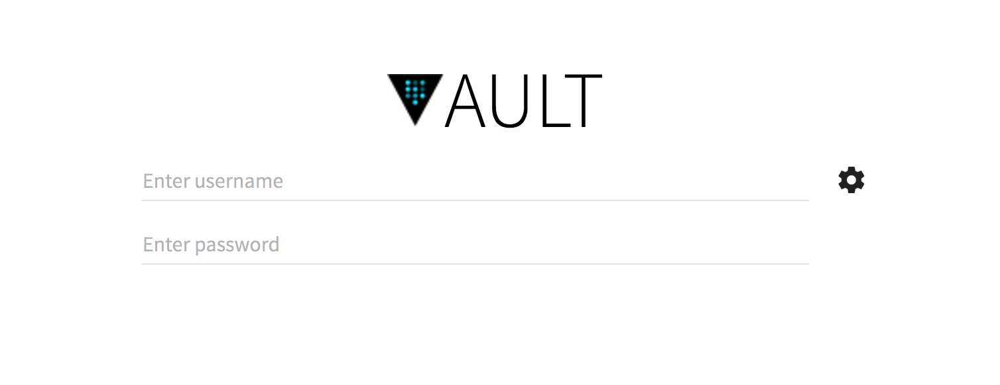

# Adding a User Interface

While the Vault CLI is incredibly powerful and useful, a WebUI can make administering your secrets a little easier. [DJ Enriquez](https://github.com/djenriquez) has written a beautiful, lightweight interface for the Vault. It has been conveniently packaged into a Docker Container, which can quickly and easily be created to make managing your Vault easily.

It is compatible with various Auth Backends, most usefully the Username/Password backend. You will still need to use the Vault CLI to unseal/seal your vault, create new users, provision new backends \(both Auth and Secret\).

When you create your container, you can set a few Environment Variables which will facilitate the provisioning of your instance. We use Username and Password authentication as our primary Auth Backend, hence it is set as the default in the environment variable, but you can adapt it to fit your organization's needs.

```bash
docker pull djenriquez/vault-ui
docker create --name vault-ui \
    -e VAULT_URL_DEFAULT="<<Vault URL>>" \
    -e VAULT_AUTH_DEFAULT="USERNAMEPASSWORD" \
    -p 8000:8000 \
    --restart=always \
    djenriquez/vault-ui
```


Once you have created and started your container, you can navigate to port 8000 on the machine that you have spun up your container \(provided that your have opened the port on your firewall, etc.\)


